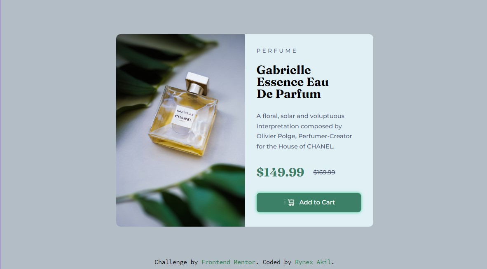

# Frontend Mentor - Product preview card component solution

This is a solution to the [Product preview card component challenge on Frontend Mentor](https://www.frontendmentor.io/challenges/product-preview-card-component-GO7UmttRfa). Frontend Mentor challenges help you improve your coding skills by building realistic projects. 

## Table of contents

- [Overview](#overview)
  - [The challenge](#the-challenge)
  - [Screenshot](#screenshot)
  - [Links](#links)
- [My process](#my-process)
  - [Built with](#built-with)
  - [What I learned](#what-i-learned)
  - [Continued development](#continued-development)
  - [Useful resources](#useful-resources)
- [Author](#author)
- [Acknowledgments](#acknowledgments)


### The challenge

Users should be able to:

- View the optimal layout depending on their device's screen size
- See hover and focus states for interactive elements

### Screenshot



### Links

- Solution URL: [Add solution URL here](https://your-solution-url.com)
- Live Site URL: [Live](https://rynex-zv.github.io/product-preview-card/)

## My process

### Built with

- Semantic HTML5 markup
- SCSS Superstar custom properties
- chrome
- JS inline

### What I learned

-how to await in JS, and how to change attributes values. but what is resolve I have no idea, I tired passing  ``` x.setAttribute("c", "n");``` in to it and the button did not work at all!
```js
  let x = document.getElementById("submeter");
    x.onclick = async  ()=> {
      x.setAttribute("c","y");
      await resolveAfter2Seconds(10);
       x.setAttribute("c", "n");
    };
    function resolveAfter2Seconds(x) { 
        return new Promise((resolve) => {
          setTimeout(() => {
            resolve(x);
          }, 2100);
        });
      }
``` 

-SVG!! OOh SVG, the animation there is not that good, but 🎉animation🎉 I have spent on it over 6h to get the timing right.

-SVG: do not accept ::before and ::after on or in.

-Animation curve's it's not that difficult, but chrome divTools did help writing the CSS code. 
``` CSS
 { 
  animation: 1.5s alternate cubic-bezier(0.31, -0.06, 0.3, 0.97);
 }
```

### Continued development

-SVG needed a little more work on!
-reducing duplicated lines.
-using rem and em rather than px!


  ### Useful resources

  - [Krita](https://krita.org/en/) - Tis is a drawing program but it have a nice futures like a ruler!!


## Author

  - LinkedIn - [Rynex Akil](https://www.your-site.com)
  - Frontend Mentor - [@rynex-zv](https://www.frontendmentor.io/profile/rynex-zv)


## Acknowledgments

 - [await js](https://developer.mozilla.org/en-US/docs/Web/JavaScript/Reference/Operators/await)